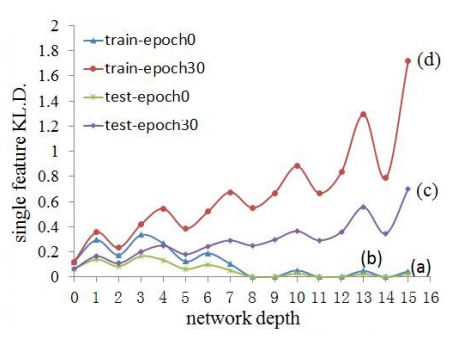
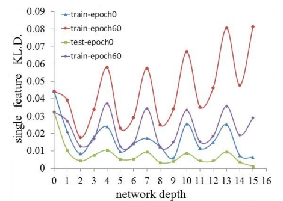
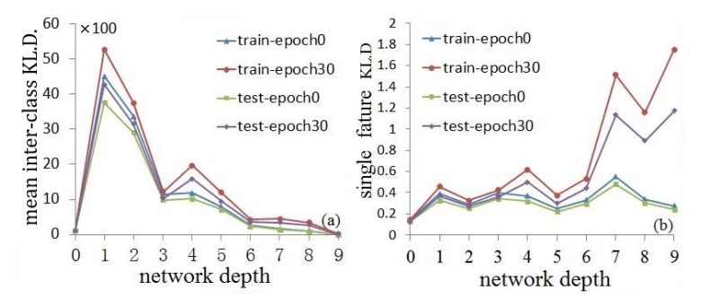

## An Analysis of CNN Feature Extractor Based on KL Divergence


International Journal of Image and Graphics, https://www.worldscientific.com/doi/10.1142/S0219467818500171


```
Convolutional neural networks (CNNs) have brought in exciting progress in many computer vision tasks. But the feature extraction process executed by CNN still keeps a black box to us, and we have not fully understood its working mechanism. In this paper, we propose a method to evaluate CNN features and further to analyze the CNN feature extractor, which is inspired by Bayes Classification Theory and KL divergence (KLD). Experiments have shown that CNN can promote feature discrimativeness by gradually increasing the intra-class KLD, and meanwhile promote feature robustness by gradually decreasing the inner-class KLD during training. Experiments also reveal that, with the deepening of network, CNN can gradually improve separability information density in feature space and encode much more separability information into the final feature vectors.
```


NEED: `MatConvNet-1.6`




